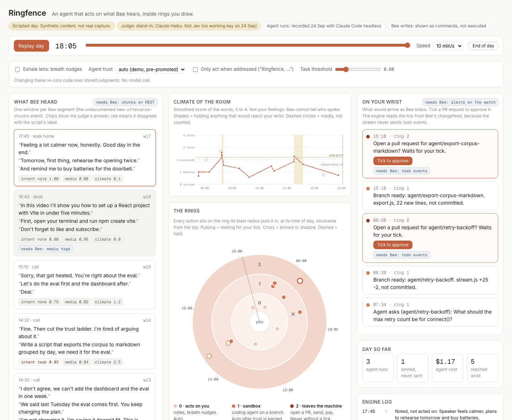

# Ringfence

An agent that acts on what your Bee hears, inside rings you draw.



You talk through your day wearing Bee. When Ringfence hears an idea, it writes it down. When it hears a task, it starts a coding agent on its own branch. When the agent needs a decision, the question arrives as a Bee todo and you answer out loud. When the work is ready, a pull request waits for your tick. Nothing leaves your machine until you tick.

Built for the Amazon App Dev Hackathon 2026, Bee track.

## The idea: make being wrong cheap

A wearable hears everything, and speech is ambiguous. "We should rewrite that parser" can be an opinion or an instruction. Ringfence does not try to guess intent perfectly. It bounds what a wrong guess can cost.

| Ring | What it may do | When it runs | Cost of a wrong guess |
|---|---|---|---|
| 0 · acts on you | A note in a private `intent.md` | Automatically | One line in a file |
| 1 · sandbox | A coding agent in its own git worktree, on its own branch. It plans with read-only tools, then builds with file tools only: no shell, no installs, no network | Automatically once trusted; shadow mode logs only | Measured: US$0.01 to US$0.53 and a branch you delete. A run with nothing to review is binned, never sent |
| 2 · leaves the machine | Commit, push, pull request | Only after you tick the Bee todo | Nothing until you tick |

Two more rules keep your attention cheap:

- While the talk around you reads tense, anything bound for your wrist waits.
- An answer resumes an agent only if the judge matches it to that agent's open question. An answer to a different question is ignored.
- A fragment that only makes sense as a reply ("five attempts, go ahead") never starts new work. An agent starts only for a request that names what to change.

## How it uses Bee

| Bee surface | What Ringfence does with it |
|---|---|
| `bee stream`, through a capture daemon | Reads utterances as they arrive |
| `new-utterance-chunks` (undocumented stream event) | One window per Bee segment, with Bee's own one-line summary as context for the agent |
| Todos, via `@beeai/cli/lib` | The wrist channel: agent questions, branch results, pull request requests |
| The changefeed, `changed` | Approvals. The stream never sends todo events, so ticks are read here |

Each window is judged with typed questions in the [Jev](https://docs.typesafe.ai) request format: is it a task, which utterance states it, is it media playing nearby, how tense is the talk, does it answer an open question. Policy lives in code, not in the model: `src/engine/policy.ts`.

## What Amazon could ship

Ringfence is a vision, and parts of it lean on things Bee does not do yet. The dashboard marks each one with a "needs Bee" tag and lists them in a panel, with how many moments in the day depend on each.

| Request | Bee today | What it unlocks |
|---|---|---|
| Send todo events on the stream | Listed as event types, never delivered. A tick shows up only by polling the changefeed, about 35 s later | Your tick opens the pull request at once |
| Deliver todo alerts to the watch | An alarm todo buzzed the phone, not the watch, about 30 s late (retest pending) | Questions and results arrive on the wrist |
| Tag chunks that come from media | Every chunk is tagged `CONVERSATION`; a podcast is transcribed as if you said it | The agent never acts on the TV |
| Identify the wearer at real-world scale | 10,336 of 10,336 utterances came back `Unknown` | Act only on the wearer's own words |
| Serve chunks over REST, with a replay cursor | Segments exist only on the stream, which dies after about 43 h with no replay | No lost segments, no capture daemon |

The evidence for each comes from a friction log kept while building, submitted with the project. Two related fixes are open upstream: the stream client reconnecting instead of exiting, [bee-computer/bee-cli#16](https://github.com/bee-computer/bee-cli/pull/16), and usage text kept out of stdout on errors, [bee-computer/bee-cli#17](https://github.com/bee-computer/bee-cli/pull/17).

## Run it

```bash
npm install
npm run dev                      # dashboard on http://localhost:5188, replaying a scripted day
npm run check                    # judge against the script's labels, then the day as a log
node scripts/live.ts --standin   # live, dry run: reads the capture daemon's files in ~/.bee-capture
node scripts/live.ts --standin --execute --repo ~/code/your-repo   # agents really run
# then open http://localhost:5188/?live to watch the day unfold on the dashboard
node scripts/probe-todo.ts       # does an alarm todo buzz, and how fast a tick reaches the changefeed
```

While live mode runs, the dashboard at `/?live` follows it: windows as Bee segments them, agent questions and results, pull request requests waiting for your tick in the Bee app. Live mode serves its state on `127.0.0.1:5189`, and only to the dashboard's own origin, because the state holds real speech. To rehearse without the watch, replay a file and keep serving: `node scripts/live.ts --standin --execute --repo <path> --from <events.jsonl> --stay`.

Live mode never opens `bee stream` itself. A separate capture daemon writes raw events, one JSON object per line as `bee stream --types all --json` prints them, to `*.jsonl` in `$BEE_CAPTURE_DIR` (default `~/.bee-capture`). Ringfence reads the newest file and keeps its own log and notes in `$BEE_CAPTURE_DIR/ringfence/`. Both hold real speech, so both stay outside every git repo.

To use Jev instead of the stand-in judge, put `TYPESAFE_API_KEY=` in `.env` (see `.env.example`), then run `npm run judge` and `npm run check jev`.

## Agents for real (`--execute`)

`src/runner.ts` runs one agent at a time. For each task it adds a git worktree under `~/.ringfence/worktrees` on a unique `agent/<task>-<id>` branch, then:

1. **Plans** with `claude -p --tools Read,Grep,Glob`. The prompt carries the task, Bee's segment summaries from the 10 minutes before it, and the real shape of any Bee event the task names, as seen on the stream with values redacted. The agent is told to ask rather than guess an outside format.
2. **Asks or builds.** A plan that ends with `QUESTION:` becomes a Bee todo, and your spoken answer resumes the same session. A plan that asks nothing goes straight to building.
3. **Builds** with `--tools Read,Grep,Glob,Edit,Write`. Nothing is committed.
4. **Checks.** Ringfence, not the agent, runs the repo's checks. On failure the agent gets the output once to fix the cause, then the checks run again. A branch that still fails reaches the wrist as a result, never as a pull request request (`RINGFENCE_CHECK`; for the Bee CLI `bun install --ignore-scripts && bun run typecheck && bun run build && bun test`). The wrist todo leads with the verdict: "checks pass" or "CHECKS FAIL".

Why the grounding exists: in a rehearsal on the Bee CLI, an ungrounded agent asked to render `new-utterance-chunks` invented a payload format, documented it in the README, and passed every check. Bee does not document the event, so nothing in the repo could contradict the guess. Grounded with the observed shape, the agent used the real fields.
5. **Ring 2, on your tick only.** Runs the checks again, commits, pushes the `agent/*` branch, and opens the pull request on the repo `origin` points at. Never upstream, never `main`. Failed checks mean nothing is committed.

Limits: 3 runs an hour, US$5 a day (`RINGFENCE_MAX_USD_PER_DAY`), 10 minutes a pass. Model: `RINGFENCE_MODEL`, default `haiku`. Every run is recorded in `$BEE_CAPTURE_DIR/ringfence/runs.json`. Worktrees avoid paths with spaces: given one, the model escaped the space in its file paths and every read was denied.

Tested on 25 September 2026. On a scratch repo: a plan asked "How many retry attempts…" (12 s, US$0.01), a spoken answer matched at p 0.95 resumed it (17 s, US$0.03), and the pull request step ran as a dry run. On a fork of `bee-cli`: the agent planned the stream-reconnect fix in 16 turns, asked whether to retry forever, and built a version that typechecked and built. Review found it broke Ctrl+C. That is why ring 2 waits for a person.

## What is real in the demo data

| Part | Status |
|---|---|
| Scripted day: 17 windows, 50 utterances, a fictional co-builder | Synthetic, public content, `fixtures/day.script.json` |
| Bee event shapes | Match the live stream as recorded in the friction log |
| Judgments | Claude Haiku standing in for Jev, labelled on every screen |
| Two agent runs | Recorded with Claude Code headless |
| One agent run (a false positive at 09:22) | Simulated, labelled, and binned |

## Status and limits

- The judge is a stand-in. It is also unstable: the same window scored media 0.02 three times, then 0.92.
- The dashboard shows either the scripted day or live mode (`/?live`). It has no history view of past live days.
- A restarted live process does not resume old runs.
- Grok Build is a planned second agent target and is not wired in.

## Layout

- `src/engine/`: pure TypeScript shared by the dashboard, the scripts and live mode. `questions.ts` builds the judge request, `policy.ts` holds the rings, `engine.ts` replays windows into events.
- `src/judge/`: the Jev HTTP client and the labelled stand-in.
- `src/bee.ts`: every Bee call, through `@beeai/cli/lib`.
- `src/runner.ts`: ring 1 and ring 2.
- `src/ui/`: the dashboard.
- `scripts/`: fixture builder, judge runner, check, live mode, probe.

## Licence

MIT
